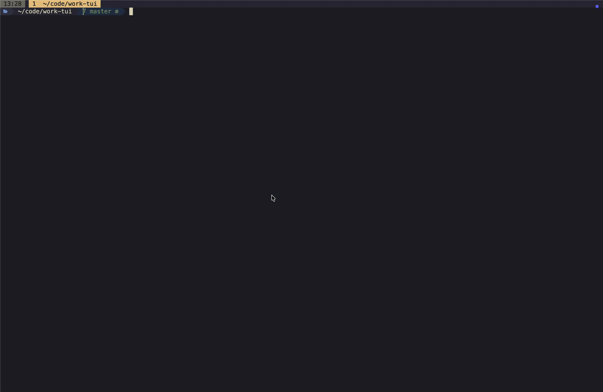

# work-tui

A terminal UI for picking up work.



## Prerequisites

- Rust toolchain (`cargo`)
- [GitHub CLI](https://cli.github.com/) (`gh`) — authenticated and available on `$PATH`

## Configuration

Set Jira credentials and repository root through environment variables:

```sh
export JIRA_URL="https://yourteam.atlassian.net"
export JIRA_EMAIL="you@example.com"
export JIRA_API_TOKEN="your-api-token" # https://id.atlassian.com/manage-profile/security/api-tokens
export REPOS_DIR="/Users/daveystruijk/code"
```

Press `F` in the app to choose the Jira project, visible statuses, and whether repo auto-tagging is enabled for that project. The selection is cached.

Default hidden statuses: `Done`, `On development`, `Canceled`.

## Usage

```sh
cargo run --bin work-tui
```
