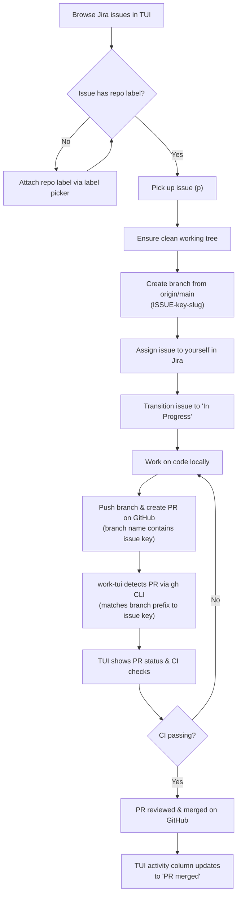
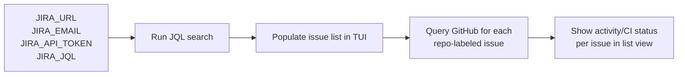
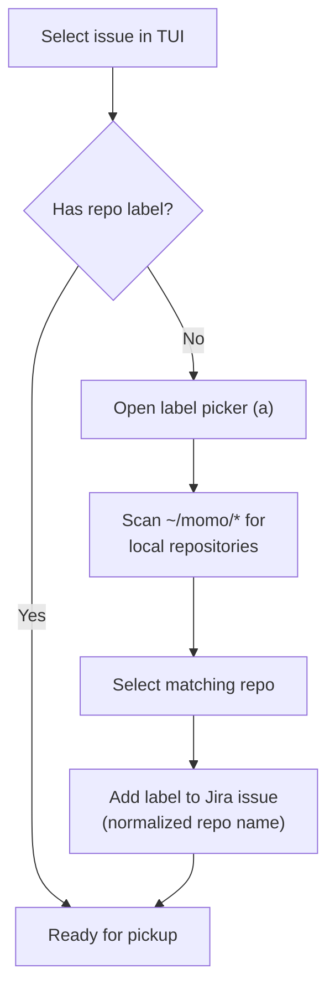
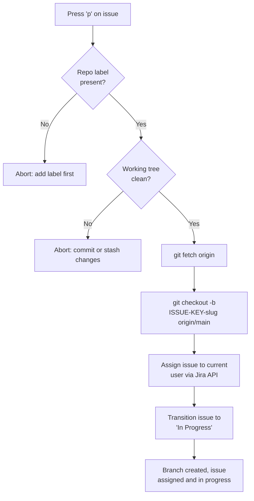
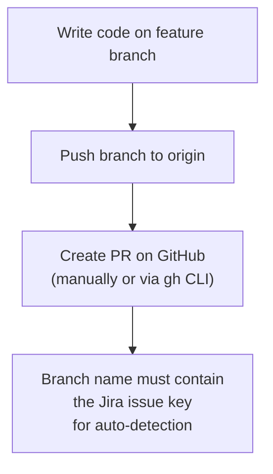
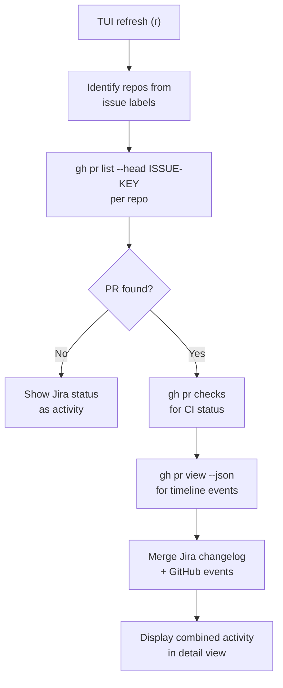
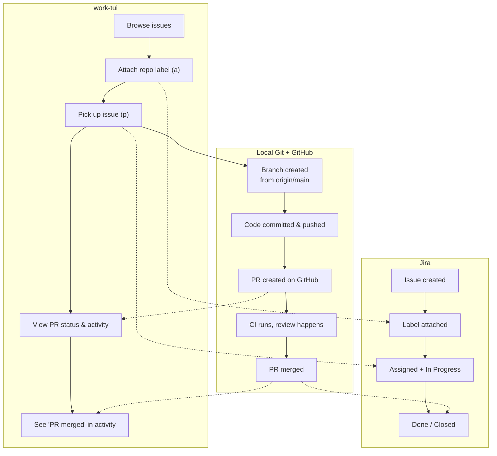

# Jira <-> GitHub Workflow

This document describes the typical workflow when using `work-tui` to manage
Jira issues alongside local Git repositories and GitHub pull requests.

## High-level flow

## Step-by-step breakdown

### 1. Issue discovery

On launch (or pressing `r`), the TUI fetches issues from Jira using the
configured JQL query. It then scans for matching GitHub PRs by checking if a
branch with the issue key exists in the linked repository.

### 2. Repo linkage via labels

Jira issues are linked to local Git repositories through **labels**. Each label
corresponds to a directory under `~/momo/`. The label picker normalizes names
(lowercase, alphanumeric + dashes) so Jira labels match directory names.

### 3. Picking up an issue

This is the core automation step. A single keypress creates the branch, assigns
the ticket, and moves it to "In Progress" in Jira.

### 4. Development & PR creation

PR creation happens **outside** the TUI (e.g. via `gh pr create` or the GitHub
UI). The only requirement is that the branch name starts with the Jira issue
key, which is guaranteed when using the pickup flow.

### 5. Status syncing

The TUI continuously merges information from both systems:

| Source | Data |
|--------|------|
| Jira | Issue status, assignee, transitions, description changes |
| GitHub | PR state (open/merged/closed), reviews, CI check results |

GitHub events take priority in the activity column when a PR exists; otherwise
the TUI falls back to Jira status heuristics.

## Complete lifecycle

## Keyboard shortcuts reference

| Key | Screen | Action |
|-----|--------|--------|
| `r` | List / Detail | Refresh issues + GitHub statuses |
| `p` | List / Detail | Pick up issue (branch + assign + transition) |
| `a` | Detail | Open repo label picker |
| `e` | List / Detail | Edit issue description |
| `o` | List / Detail | Open issue in browser |
| `n` | List | Create new Jira issue |
| `Enter` | List | View issue detail |
| `Esc` | Detail / Picker / Edit | Go back |
