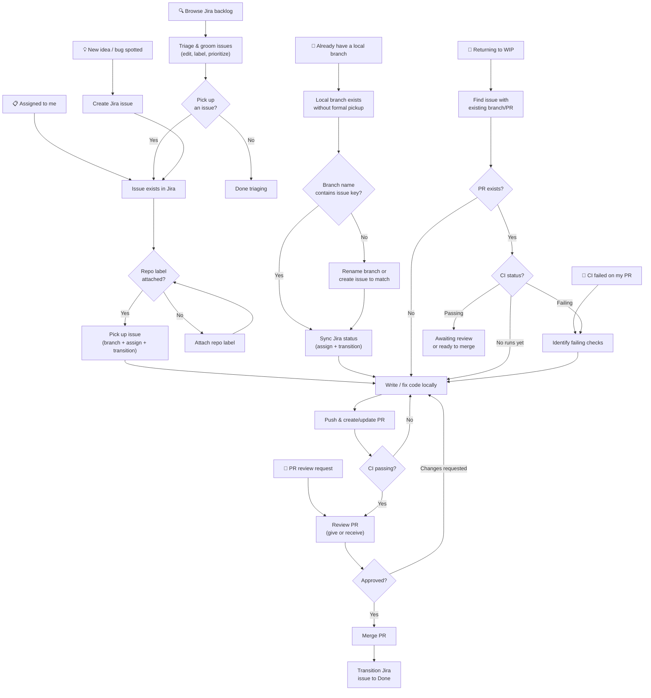
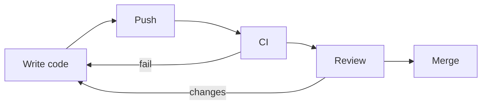

# Workflow Entrypoints

A developer doesn't always start from the same place. This document maps out
the different entrypoints into a typical Jira + GitHub workflow and how they
converge into a shared development loop.

## Overview

## Entrypoints explained

### 1. Browse Jira backlog

> *"Let me see what needs doing."*

You open the TUI with no specific task in mind. You're scanning the backlog,
reading descriptions, maybe grooming (editing descriptions, attaching labels,
reprioritizing). You might pick something up, or just organize.

### 2. Assigned to me

> *"Someone assigned me a ticket."*

An issue already has your name on it. You open the TUI, find it in your list,
and pick it up — creating a branch and transitioning it to "In Progress" in one
step.

### 3. New idea / bug spotted

> *"I just found a bug"* or *"I have an idea for a feature."*

No Jira issue exists yet. You create one from the TUI (or Jira directly), then
immediately pick it up and start working.

### 4. Already have a local branch

> *"I started hacking on something before opening the TUI."*

You already have code on a branch. The workflow needs to **reconcile** — link
the branch to a Jira issue (by key in the branch name), sync the Jira status,
and continue into the normal development loop.

### 5. PR review request

> *"Someone asked me to review their PR."*

You're entering the workflow from the GitHub side. You need to find the related
Jira issue for context, review the code, and leave feedback. You're not the
author — you're a participant.

### 6. CI failed on my PR

> *"My build is red."*

You need to quickly find the issue, see which checks failed, jump back into the
code, fix it, and push again. The entrypoint is the failure notification — the
TUI should surface this prominently.

### 7. Returning to work-in-progress

> *"I context-switched yesterday, where was I?"*

You need to find your in-flight work. The TUI should make it obvious which
issues have active branches, open PRs, and what state they're in (waiting for
CI, waiting for review, changes requested, etc.).

## How entrypoints converge

All paths eventually feed into the same **development loop**:

The value of mapping entrypoints is understanding that the "pick up from Jira"
path is just one of many. A good work TUI should make **every** entrypoint
feel natural — not just the happy path.
